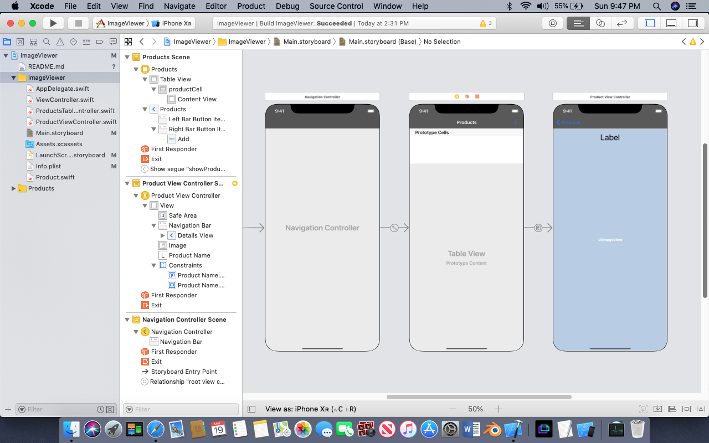

# Image Viewer using tableView Controller

## Our Goal

Its a simplest project to understand tableView and its controller, Navigation controller

## What you will create

We will create a project contains of few image with title, when we click oper the title or image its let let you to the next slide with full view of that image

## What you will learn

* Import imageset 
* Create data model
* tableView, tableView Controller and show data into the cell, setting tap action
* UI Navigation Controller


## Let's Learn

Create a new project by named imageViewer
Go to Assets.xcaseets, create New Image Set, drag and drop your selected image to its 2x
Go to Storyboard, delete deafult View Controller, from project navigator also delete ViewController.swift
On Storyboard open object library (Shift+CMD+L) drag and drop a  new TableViewController, add a cocoatuch class by named ProductsTableViewController.swift subclass of UITableViewController, select your TableViewController from Storyboard, Navigat to Identity Inspector, assign ProductsTableViewController.swift as class of this controller
Similary insert another ViewController, create ProductViewController.swift and assign it.
Add a swift file to the project by name Product.swift

Go to TableViewController select table, from Attribute inspector, increase Prototype Cell 0 to 1
Select this cell, from Attribute Inspector add a identifier to this cell say 'productCell'
From size inspector make cell height 100

Go to product view controller add a image viewer, using auto layout make image viewer fill to the view, also place a label top of the view

Now from Produc Table VC selct its cell, control drag to next VC to create a segue kind Show, select the segue, from attribute Inspector, add an identity 'showProduct'

Select ProductTableVC, goto Editor->Embed In->Navigation controller. Its will insert a new controller to ProductTableVC & a back button to ProducVC. Select Navigation Controller bar from Story board and enter title whatever you want.



Go to Product.Swift file create a database class with initialized 3 rows 

```swift
import Foundation

class Product {
var name: String?
var ImageName: String?
var largeImageName: String?

init(name: String, ImageName: String, largeImageName: String) {
self.name = name
self.ImageName = ImageName
self.largeImageName = largeImageName
}
}
```
Go to ProductTableViewController.swift add those code

```swift
import UIKit

class ProductsTableViewController: UITableViewController {
private var products: [Product]?
private let identifer = "productCell"

override func viewDidLoad() {
super.viewDidLoad()

products = [
Product(name: "This is my first image", ImageName: "One", largeImageName: "OneX"),
Product(name: "This is my second image", ImageName: "Two", largeImageName: "TwoX")
]
}

override func tableView(_ tableView: UITableView,
numberOfRowsInSection section: Int) -> Int
{
return products?.count ?? 0
}

override func tableView(_ tableView: UITableView,
cellForRowAt indexPath: IndexPath) -> UITableViewCell
{
let cell = tableView.dequeueReusableCell(withIdentifier: identifer, for: indexPath)
guard let products = products else { return cell }

cell.textLabel?.text = products[indexPath.row].name

if let imageName = products[indexPath.row].ImageName {
cell.imageView?.image = UIImage(named: imageName)
}

return cell;
}

override func prepare(for segue: UIStoryboardSegue, sender: Any?) {
if segue.identifier == "showProduct"{
if let cell = sender as? UITableViewCell,
let indexPath = tableView.indexPath(for: cell),
let productVC = segue.destination as? ProductViewController{
productVC.product = products?[indexPath.row]
}
}
}

}
```
Go to ProductViewController.swif add those following lines of code
```swift
mport UIKit

class ProductViewController: UIViewController {


@IBOutlet weak var productName: UILabel!
@IBOutlet weak var image: UIImageView!
var product : Product?

override func viewDidLoad() {
super.viewDidLoad()

productName.text = product?.name
if let currentImage = product?.largeImageName{
image.image = UIImage(named: currentImage)
}
}

}
```


Check out the full course and more at 


[www.joyonlineschool.com](https://www.joyonlineschool.com/)


